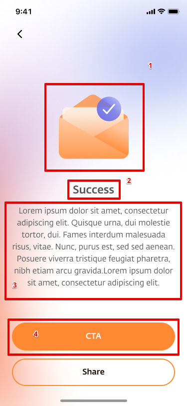

## TMA UI <-> UEP BE API Mappings

#### Servers 

|             | Base URL |
| ----------- | -------- |
| Development | `https://oab-api-dev.togg.com.tr/mobileapp-rest`  |
| Test        | `https://oab-api-test.togg.com.tr/mobileapp-rest` |

### Loyalty Management

* GET: `/loyalty/management/inquireLoyalty/{toggId}`

*Inquire Loyalty Achievements and Status of the User*

Response Body

```json
{
  "currentLoyaltyLevelOverview": {
    "loyaltyLevelId": 5,
    "loyaltyProgramProductSpecId": 1,
    "baseLoyaltyPoint": 15000,
    "levelNumber": 5,
    "perkSlot": 3,
    "notificationDefinitionShortCode": "LEVEL_5_NTF"
  },
  "nextLoyaltyLevelOverview": {
    "loyaltyLevelId": 6,
    "loyaltyProgramProductSpecId": 1,
    "baseLoyaltyPoint": 20000,
    "levelNumber": 6,
    "perkSlot": 3,
    "notificationDefinitionShortCode": "LEVEL_6_NTF"
  },
  "loyaltyPoint": 16000,
  "perkSummary": {
    "count": 0,
    "availableCount": 0,
    "inUseCount": 0,
    "newCount": 0
  },
  "rewardSummary": {
    "count": 0,
    "availableCount": 0,
    "inUseCount": 0,
    "newCount": 0
  },
  "badgeSummary": {
    "count": 3,
    "availableCount": 0,
    "inUseCount": 0,
    "newCount": 1
  },
  "voucherSummary": {
    "count": 0,
    "availableCount": 0,
    "inUseCount": 0,
    "newCount": 0
  },
  "perkList": [],
  "rewardList": [],
  "boosterList": [],
  "badgeList": [
    {
      "loyaltyMemberBadgeId": 27,
      "loyaltyBadge": {
        "loyaltyBadgeId": 1,
        "shortCode": "TRANSFORMATION",
        "badgeType": "ONETIME",
        "badgeVisibilityType": "PUBLIC",
        "name": "You Love Your World",
        "description": "You transformed your car to TOGG",
        "title": "You Love Your World",
        "goalExplanation": "You will earn this badge by transforming your car to TOGG",
        "badgeIcon": {
          "type": "PICTURE",
          "mediaUrl": "https://etiyatoggstorage.blob.core.windows.net/etiyacontainer-public/images-togg/badges_Icon/TRANSFORMATION_en.png",
          "name": "TRANSFORMATION_en",
          "targetUrl": "NULL",
          "priority": 0
        }
      },
      "status": "ACTV",
      "createDate": 1634134028219,
      "screenStatus": "NEW"
    },
    {
      "loyaltyBadge": {
        "loyaltyBadgeId": 1,
        "shortCode": "TRANSFORMATION",
        "badgeType": "ONETIME",
        "badgeVisibilityType": "PUBLIC",
        "name": "You Love Your World",
        "description": "User is transformed car to TOGG_en",
        "title": "You Love Your World",
        "goalExplanation": "You have transformed your car to TOGG"
      }
    },
    {
      "loyaltyBadge": {
        "loyaltyBadgeId": 3,
        "shortCode": "WELCOME_TOGG",
        "badgeType": "ONETIME",
        "badgeVisibilityType": "PRIVATE",
        "name": "WELCOME_TOGG_en",
        "description": "New user is created",
        "title": "Opens every doors",
        "goalExplanation": "Opens every doors"
      }
    }
  ],
  "voucherList": [],
  "maxSlotNumber": 1,
  "loyaltyLevelList": [
    {
      "loyaltyLevelId": 1,
      "baseLoyaltyPoint": 0,
      "levelNumber": 0,
      "perkSlot": 1,
      "notificationDefinitionShortCode": "LEVEL_1_NTF",
      "programSpec": {
        "loyaltyProgramProductSpecId": 1,
        "shortCode": "Loyalty_Program_TOGG",
        "multiplier": 1,
        "minimumDepreciationLevel": 3,
        "firstDepreciationRate": 0.25,
        "depreciationRate": 0.05,
        "referenceCurrency": {
          "currencyCode": "CAD",
          "currencyName": "Canadian Dollar"
        },
        "name": "Program1_en",
        "description": "Description_en"
      },
      "rewardList": [],
      "boosterList": [],
      "perkList": []
    }
  ]
}
```


(1) `currentLoyaltyLevelOverview.levelNumber`

(2) 

current (`loyalityPoint`) => User's current point

min = `currentLoyaltyLevelOverview.baseLoyaltyPoint`

max = `nextLoyaltyLevelOverview.baseLoyaltyPoint`

Progress = (current - min) / (max - min)

Sample;

current = 16000 <br>
min = 15000 <br>
max = 20000 <br>
progress = (16000 - 15000) / (20000 - 15000) = 0.2

(3) `badgeSummary.count`

(4) badge list is populated from `badgeList` list.

Each item in screen represents one item in this list.

Earned Badge = `loyaltyMemberBadgeId != null && status == "ACTV"`

(5) `loyaltyBadge.badgeIcon.mediaUrl`

(6) `loyaltyBadge.name`

(7) 

Earned Badge = `loyaltyMemberBadgeId != null && status == "ACTV"` 
if false means the badge is not earned.

---

#### inquireLoyalty

* GET: `/loyalty/management/inquireLoyalty/{toggId}`

*Inquire Loyalty Achievements and Status of the User*

Response Body is same as above, so this screen is represented from an object that exist in `badgeList` field.



(1) `loyaltyBadge.badgeIcon.mediaUrl`

(2) `loyaltyBadge.name`

(3) `loyaltyBadge.description`

(4) If `loyaltyBadge.relatedURL` is valid, "CTA" button action triggers that link to be open. 

**Note: Button name is not clear, waiting from AlphaDog**
